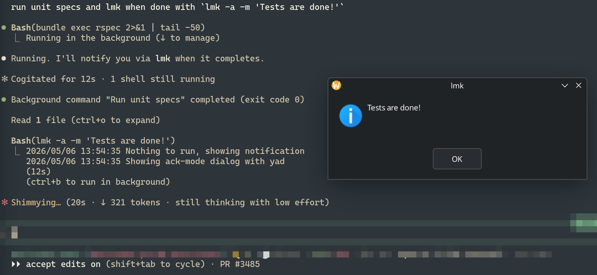

_Part 6 of [Modernizing my Terminal-Based Development Environment](/blog/2025/11/11/modernizing-my-terminal-based-dev-environment/). [Part 5][crib-post] introduced [crib][crib]._

Let's say a Capybara spec fails inside the container and dumps a screenshot to a png in `tmp/`. How do I open it from inside the container?

Sure, I can open the file explorer on my host machine, navigate to the project / worktree root and find the file. But with some "magic" I can just `xdg-open` it from inside the container and have it pop up in my default KDE image viewer.

Same trick can handle a few other things, like `pbcopy` text inside the container and paste it on the host, or get a desktop notification from a Rake task that has no idea it's running in a container.

Three tools make this possible: crib, cartage, and lmk.

## The bridge I keep rebuilding

I've been rebuilding a bridge between virtualized dev envs and the host since 2012. [vagrant-notify][vagrant-notify] forwarded `notify-send` from a Vagrant guest to the host over TCP, then [notify-send-http][notify-send-http] swapped TCP for HTTP a couple years later. More recently, [desk-notify][desk-notify] went down the Unix sockets path in 2025 with a "busybox style `argv[0]` trick".

desk-notify got vibe coded into existence as a Rust project, hoping I'd dig into the code and learn the language over time. In the end I just wanted the bridge, so I got Claude to rewrite the whole thing to Go in like less than an hour (a language I actually know).

Each iteration of this bridge was simpler and more general than the last, so in March I decided to expand the idea beyond notifications and [cartage][cartage] was born.

Cartage's idea is to have a bunch of things that work through one socket / daemon / binary. Start the daemon on the host (one-time setup, see [cartage's README][cartage]), mount the socket into containers, symlink / mount the binary as `notify-send`, `xdg-open`, `pbcopy`, `pbpaste`, `yad`, `zenity`, `kdialog` and it figures out what to do from `argv[0]`. That's the trick that made [lmk][lmk] work inside containers without lmk knowing anything about cartage, since lmk just shells out to `zenity`/`yad`/`kdialog`.

Path mapping handles the `xdg-open` gap so a path like `/workspaces/foo/bug.png` inside the container resolves to the real one on the host before `xdg-open` runs.

## crib 0.9, in use

The 0.9 release from last week added a `[workspace]` section to the global config. A few lines wire cartage and lmk into every container I open, no `devcontainer.json` or `compose.yaml` edits per project:

```toml
# ~/.config/crib/config.toml
[workspace]
env = { CARTAGE_PATH_MAP = "/workspaces:${localWorkspaceFolder}/.." }
mount = [
  "type=bind,source=${localEnv:HOME}/.local/bin/cartage,target=/usr/local/bin/notify-send,readonly",
  "type=bind,source=${localEnv:HOME}/.local/bin/cartage,target=/usr/local/bin/xdg-open,readonly",
  "type=bind,source=${localEnv:HOME}/.local/bin/cartage,target=/usr/local/bin/yad,readonly",
  "type=bind,source=${localEnv:HOME}/.local/bin/lmk,target=/usr/local/bin/lmk,readonly",
  "type=bind,source=${localEnv:HOME}/.local/bin/lazychat,target=/usr/local/bin/lazychat,readonly",
  "type=bind,source=${localEnv:XDG_RUNTIME_DIR},target=/run/host,readonly",
]
```

crib substitutes [devcontainer spec variables][devcontainer-vars] like `${localEnv:*}` and `${localWorkspaceFolder}` per workspace. The bind mounts replace `notify-send`, `xdg-open`, and `yad` inside the container with the cartage binary, so any tool that calls them ends up talking to cartage over the host socket. lmk and [lazychat][lazychat] ride along the same way.

Before 0.9 I was wiring this per project. Now it's one config and any new workspace gets it for free.

### Other 0.9 bits

A couple more things from the [changelog](https://github.com/fgrehm/crib/blob/main/CHANGELOG.md):

- **Plugin disable.** `plugins.disable = ["ssh"]` (or `--disable-plugin ssh` on the command line), shipped because [someone reported](https://github.com/fgrehm/crib/issues/37) that the SSH agent bind mount was crashing macOS + Colima containers via virtiofs.
- **`pi` support in the coding-agents plugin.** The plugin used to only handle Claude Code's credentials; now it grew a sibling for [pi](https://github.com/badlogic/pi-mono/tree/main/packages/coding-agent) under the same shared/workspace mode.

## lmk: knowing when long-running commands are done

[lmk][lmk] is older than cartage but the two finally clicked together. The idea from 2014 is dumb simple: wrap a command and pop a blocking dialog when it finishes. `lmk rspec spec/system` to run a slow-ish set of system specs. Walk away or alt-tab to something else, and the dialog will pop up and sit there until I click it.

Inside a crib container the chain looks like this: lmk shells out to `yad`, but `yad` in the container is actually the cartage binary bind-mounted under that name, so cartage forwards the call over the socket and the host daemon pops the dialog on my desktop. Three tools, one chain, lmk has no idea any of that is happening.

The new bit is that lmk now ships an agent skill (`lmk skill install`). When I tell Claude "run the tests and lmk when done", it can run `lmk -m "✅ tests passed"` at the end. Same chain, except now the agent is the one wrapping the long-running command.



That's what makes this feel different from "old tool, new container". The dialog used to be me reminding me; in 2026 it's the agent reminding me to take action, and the chain still works because cartage doesn't care who called it.

## This only exists because of containers

None of this would exist if I'd gone with a host-based dev environment. Nix-based tools like Flox, Devbox, and devenv run directly on the host, so there's no boundary to cross and nothing to bridge. Cartage and friends are the price of choosing containers as the isolation boundary instead.

And that price is going up, not down. The next wave of isolation is microVMs and agent sandboxes ([Firecracker][firecracker], [smolmachines][smolmachines], [gondolin][gondolin]). As more of my work gets handed to agents running in tighter sandboxes, the same shape keeps showing up: the agent does the work in isolation, and a human (me) still needs to see the result.

Some of that gets handled by host-side orchestrators watching the sandbox from outside. But anytime the work inside wants to express intent, like "open this" or "ping me when done", the bridge is back.

## That's it

This will probably keep happening. Whatever the next isolation tech is, the same or new gaps will show up, and I'll probably end up building yet another bridge if something annoys me enough. For now though, [crib][crib] / [cartage][cartage] / [lmk][lmk] are what keep the team's shared `devcontainer.json` honest while I live in nvim + zellij.

[crib-post]: /blog/2026/03/20/crib-just-enough-devcontainers/
[crib]: https://github.com/fgrehm/crib
[cartage]: https://github.com/fgrehm/cartage
[desk-notify]: https://github.com/fgrehm/desk-notify
[lmk]: https://github.com/fgrehm/lmk
[lazychat]: /blog/2026/04/17/lazychat/
[vagrant-notify]: https://github.com/fgrehm/vagrant-notify
[notify-send-http]: https://github.com/fgrehm/notify-send-http
[devcontainer-vars]: https://containers.dev/implementors/json_reference/#variables-in-devcontainerjson
[firecracker]: https://firecracker-microvm.github.io/
[smolmachines]: https://smolmachines.com/
[gondolin]: https://earendil-works.github.io/gondolin/
